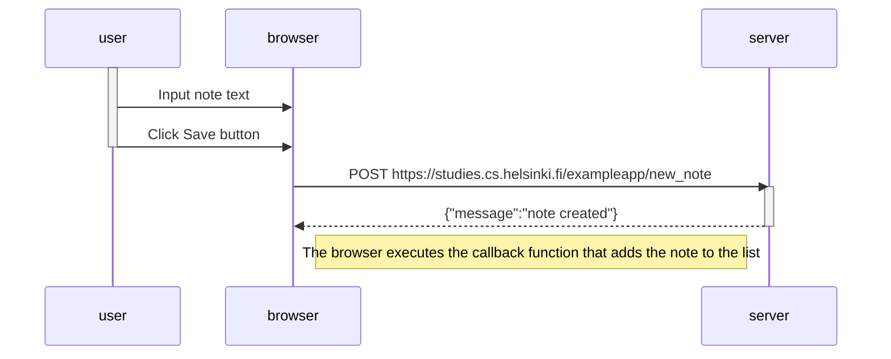

# Excersise 0.6

```mermaid
sequenceDiagram
    participant user
    participant browser
    participant server

    activate user
    user->>browser: Input note text
    user->>browser: Click Save button
    deactivate user

    browser->>server: POST https://studies.cs.helsinki.fi/exampleapp/new_note

    activate server
    server-->>browser: {"message":"note created"}
    deactivate server

    Note right of browser: The browser executes the callback function that adds the note to the list
```
